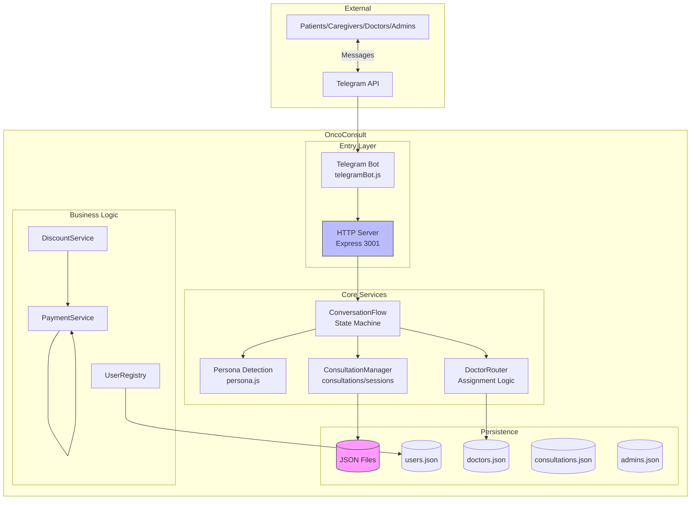
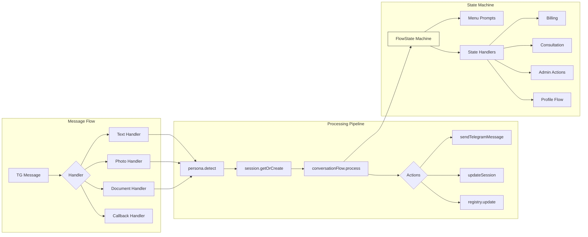
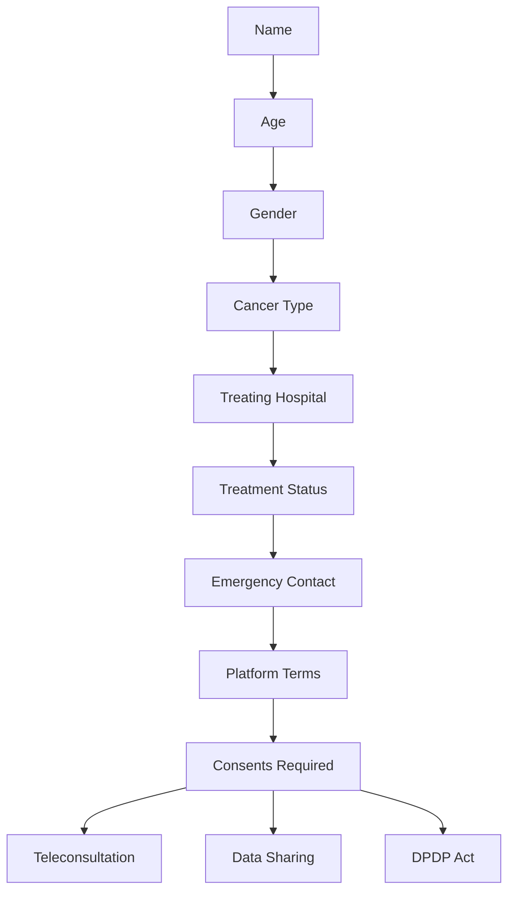
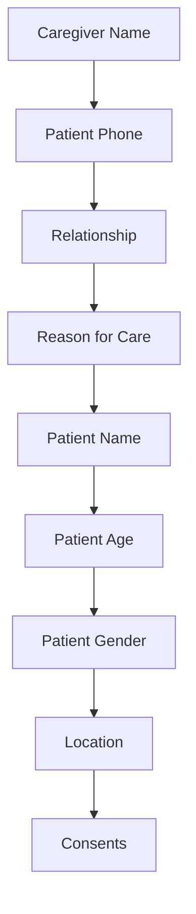
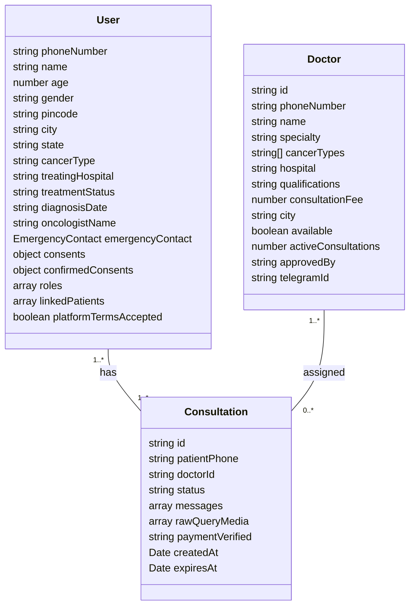
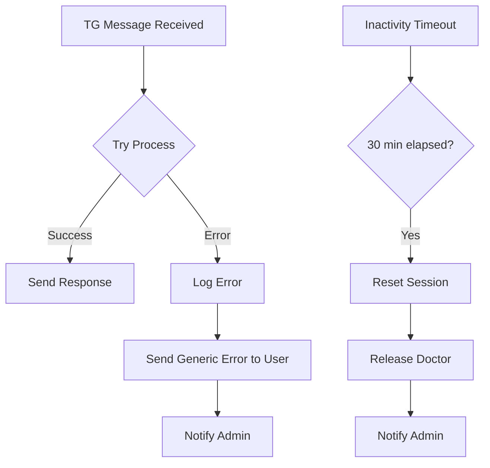
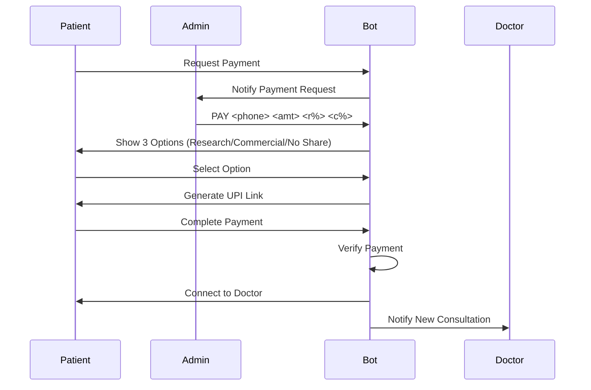

# High-Level Architecture - OncoConsult Telegram Bot

## System Overview



## Low-Level Component Architecture



---

# Persona Usage Documentation

## Patient Persona

### Commands & Menus

```
/start → Platform Terms → Role Selection → Profile Flow → Consents → Main Menu
```

**Main Menu:**
```
1️⃣ Select Cancer Type
2️⃣ View Pricing
3️⃣ Upload Reports
4️⃣ My Consultations
5️⃣ Admin Help
6️⃣ Profile & Roles
7️⃣ Clear History
0️⃣ Back (N/A)
```

**Cancer Type Selection:**
- 8 cancer types available (Breast, Lung, Prostate, etc.)
- Selection stored in session for doctor matching

**Profile Flow (8 steps):**


**Consents Required:**
1. Teleconsultation consent - medical consultation via chat
2. Data sharing consent - for research/commercial use (OPT-IN)
3. DPDP Act consent - data processing agreement

---

## Caregiver Persona

### Commands & Menus

```
/start → Role Selection (2) → Caregiver Auth → Profile Flow
```

**Caregiver Authorization:**
```
1️⃣ I am authorized caregiver
2️⃣ I am the patient
```

**Caregiver Profile Flow:**


**After Linking:**
- Uses patient's main menu with caregiver context
- Can manage linked patient's consultations
- Cannot apply for other roles

---

## Doctor Persona

### Commands & Menus

```
/start → Register/Invitation Path → Active Consultations
```

**Registration Paths:**
1. **Self-register**: `/register` → Pending → Admin Approval
2. **Invited**: Admin `INVITE_DOCTOR` → `/accept` → Active

**Doctor Menu:**
```
1️⃣ My Patients
2️⃣ Active Consultations
3️⃣ Profile
0️⃣ Switch Role
```

**During Consultation:**
- Reply to messages auto-routed to patient
- Only sees assigned patients
- Can message admin via `MSG_ADMIN`

---

## Admin Persona

### Commands & Menus

```
/start → Admin Menu → All Management Functions
```

**Admin Menu:**
```
1️⃣ Pending Requests (Payment Approvals)
2️⃣ Active Consultations
3️⃣ Role Approvals
4️⃣ Doctor Management
5️⃣ My Profile
0️⃣ Switch Role
```

**Role Approvals Menu:**
```
1️⃣ View Applications
2️⃣ Approve Doctor
3️⃣ Register Doctor
4️⃣ Invite Doctor
5️⃣ Reject Doctor
6️⃣ Message Doctor
7️⃣ Back to Menu
0️⃣ Back
```

**Doctor Management Menu:**
```
1️⃣ List Doctors
2️⃣ Assign Doctor
3️⃣ Remove Doctor
4️⃣ Message Doctor
5️⃣ Back to Menu
```

### Slash Commands

| Command | Usage | Description |
|---------|-------|-------------|
| `PAY <phone> <amount> <r%> <c%>` | Admin | Set payment with discounts |
| `CLOSE <consultation_id>` | Admin/Doctor | End consultation |
| `INVITE_DOCTOR <name> <specialty> <phone>` | Admin | Invite doctor via Telegram |
| `APPROVE_DOCTOR <phone>` | Admin | Approve pending doctor |
| `REJECT_DOCTOR <phone>` | Admin | Reject doctor application |
| `MSG_PATIENT <phone> <message>` | Admin | Message patient |
| `MSG_DOCTOR <doctor_id> <message>` | Admin | Message doctor |

---

## Super Admin Persona

**Inherited from Admin + Additional:**
- All admin privileges
- Can approve/reject any role
- Can add/remove other admins (`ADD_ADMIN`, `REMOVE_ADMIN`)
- Access via `SUPER_ADMIN_CHAT_IDS` or `SUPER_ADMIN_PHONES` env vars

---

## Data Models



---

## Error Handling & Reliability



---

## Payment & Discount Flow



---

## Compliance & Security

### DPDP Compliance
- Opt-in consent for all data sharing
- `/delete` command for data removal
- Platform terms acceptance required
- Consent tracked in `confirmedConsents` object

### Medical Safety
- Emergency disclaimer on consultation start
- "Call 108 for emergencies" displayed
- Doctor qualifications shown during assignment

### Access Control
- Role-based menu generation
- Phone number gating via `normalizePhone()`
- Doctor isolation (only sees assigned patients)
- Admin scoping (only manages approved doctors)