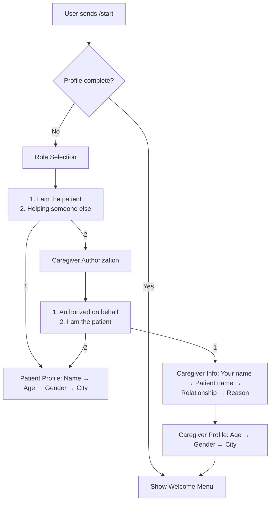
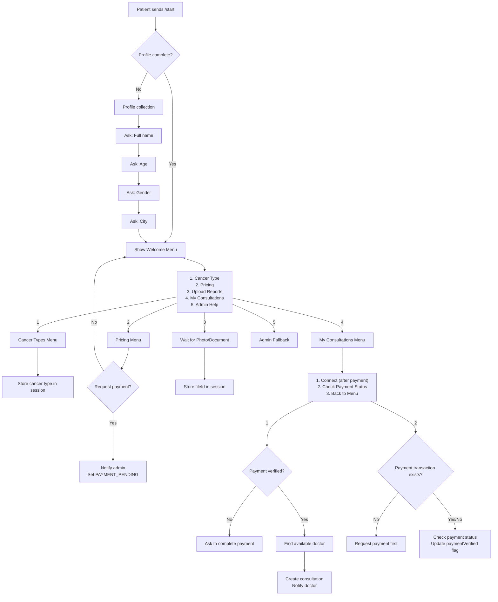
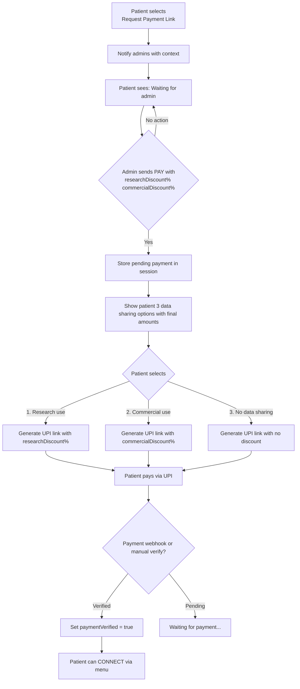
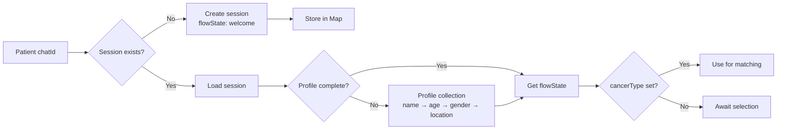
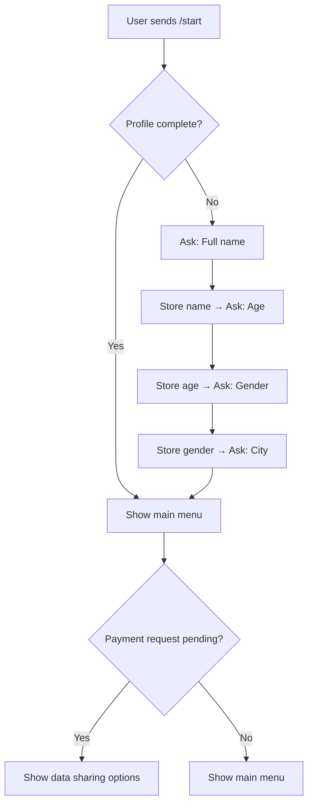
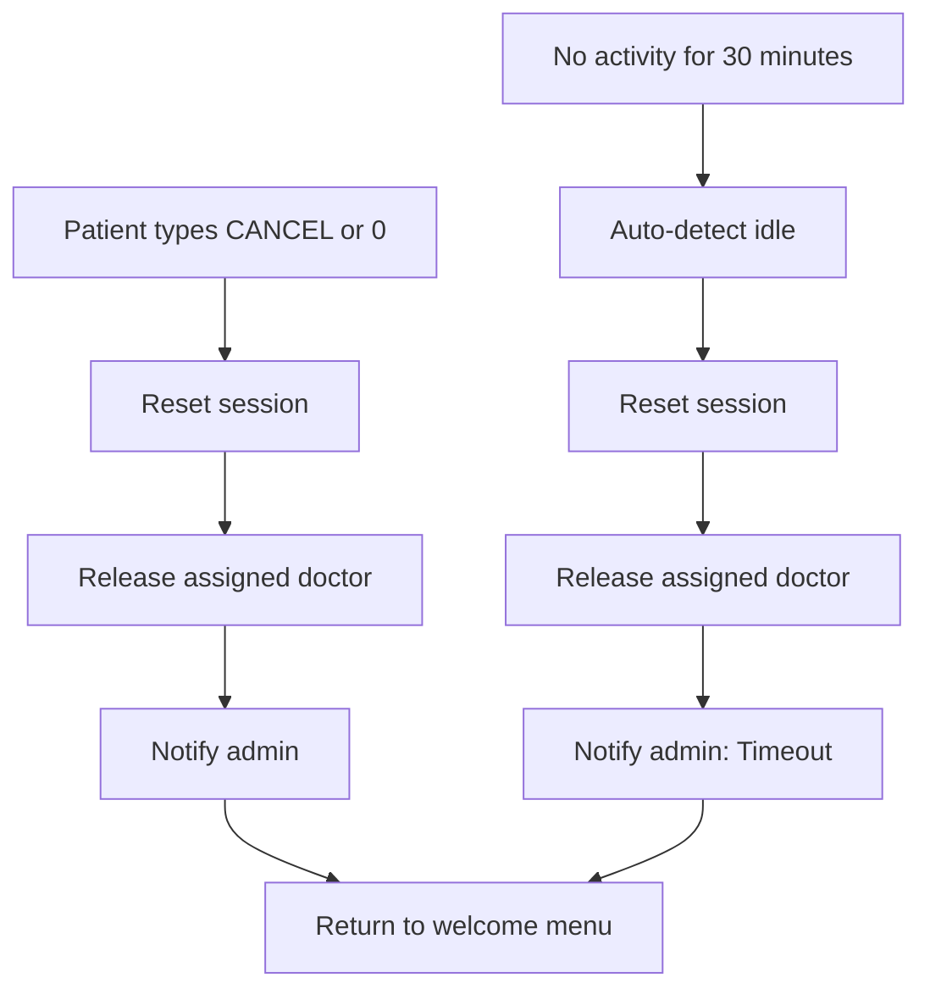
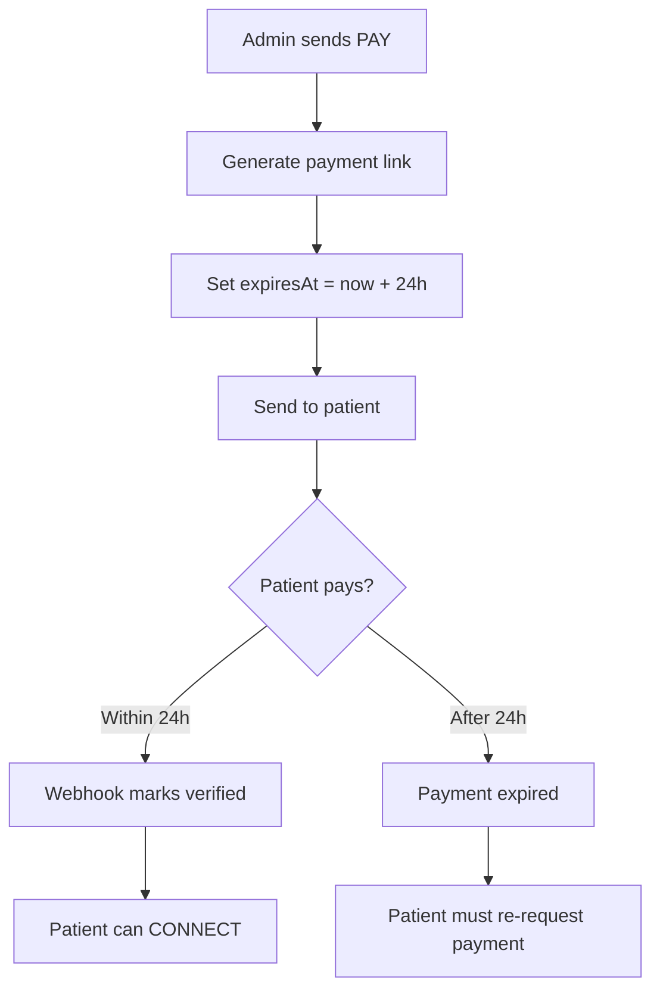
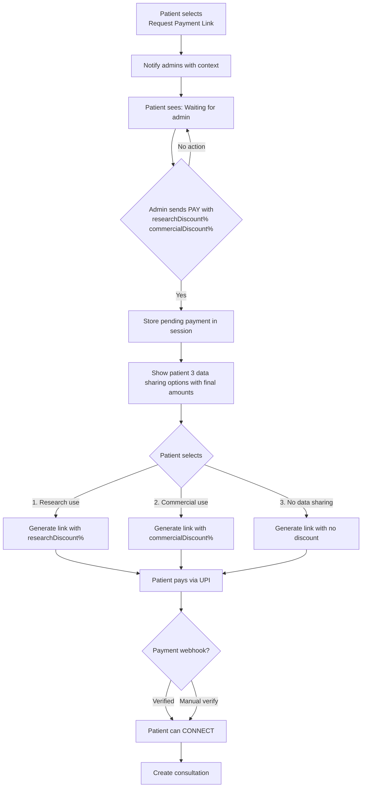

# Query Lifecycle Flow - Telegram

**Bot Setup:** See [README.md](README.md) for BotFather configuration and environment variables.

## Role Selection Flow



**Caregiver Profile Flow:**
1. Caregiver name (who is sending requests)
2. Patient name (who will receive consultation)
3. Relationship (spouse, child, guardian, friend)
4. Reason (why acting on behalf)
5. Caregiver age, gender, location

**Consent Implications:**
- Caregivers CAN provide data sharing consent with explicit acknowledgment
- Consent recorded with `consentType: 'caregiver'` for audit trail
- Caregiver confirms: "I am authorized and understand consent implications"
- Payment and consultation proceed normally

## Patient Flow



## Payment & Data Sharing Flow



## Doctor Flow

```mermaid
flowchart TD
    A[Doctor sends message] --> B{Is registered?}
    B -->|No| C[Unauthorized response]
    B -->|Yes| D[Find active consultation]
    
    D -->|No| E[No active consultation]
    D -->|Yes| F{Patient paid?}
    
    F -->|No| G[Payment pending - wait]
    F -->|Yes| H[Forward to patient via chatId]
    
H --> I[Admin CC on message]
 ```

## Admin Flow

```mermaid
flowchart TD
    A[Admin sends /start] --> B[Show Admin Menu]
    B --> C["1. Pending Requests\n2. Active Consultations\n3. Role Approvals\n4. Doctor Management\n5. My Profile\n0. Switch Role"]
    
    C -->|3| D[Role Approvals Menu]
    D --> D1["1. View Role Applications\n2. Approve Doctor\n3. Approve Caregiver\n4. Approve Support\n5. Register Doctor\n6. Invite Doctor\n7. Back"]
    D1 -->|2| D2[Enter phone to approve doctor]
    D1 -->|5| D3[Enter: NAME, SPECIALTY, PHONE, CANCERS]
    D1 -->|6| D4[Enter: NAME, SPECIALTY, PHONE, CANCERS]
    D2 -->|0| D
    D3 -->|0| D
    D4 -->|0| D
    D1 -->|7| B
    
    C -->|4| E[Doctor Management Menu]
    E --> E1["1. List Doctors\n2. List Pending Doctors\n3. Assign Doctor\n4. Remove Doctor\n5. Message Doctor\n6. Back"]
    E1 -->|1| E2[Show all doctors]
    E1 -->|2| E3[Show pending doctor requests]
    E1 -->|3| E4[Assign: CONSULTATION_ID DOCTOR_ID]
    E1 -->|4| E5[Remove: DOCTOR_ID]
    E1 -->|5| E6[Message: DOCTOR_ID MESSAGE]
    E1 -->|6| B
    E2 --> E
    E3 --> E
    E4 --> E
    E5 --> E
    E6 --> E
    
    C -->|0| F[Switch Role Menu]
 ```

## Raw Data Handling

```mermaid
flowchart TD
    A[Patient sends photo/document] --> B[Receive fileId from Telegram]
    B --> C[Store raw reference + metadata]
    C --> D[Add to session.media array]
    
    D --> E{Active consultation exists?}
    E -->|Yes| F[Link raw data to consultation.rawQueryMedia]
    E -->|No| G[Await consultation creation]
```

- No OCR processing
- Media stored as raw Telegram fileId references with receivedAt timestamps
- Doctors review raw files directly

## Session Management



## Profile Collection Flow



## Data Sharing Consent & Payment

After admin sends `PAY <phone> <amount> <researchDiscount%> <commercialDiscount%> <note>`, patient receives 3 options with dynamic discounts:

```
💳 *Choose Data Sharing Option*

Consultation fee: ₹1500

1. Yes, allow research use → 30% off → ₹1050
2. Yes, allow commercial use → 15% off → ₹1275
3. No, do not allow → No discount → ₹1500

Reply with 1, 2, or 3
```

Admin sets both discount percentages per consultation based on:
- Case complexity
- Number of queries
- Volume of attached media

## Cancel / Abandonment Flow



**Patient commands:**
- `CANCEL` or `0` from any menu → resets session, releases doctor, notifies admin
- Session is cleared but patient profile is preserved for returning users

**Auto-timeout:**
- If no activity for 30 minutes, next message triggers session reset
- Admin notified with reason: `Inactivity timeout (30 min)` or `User cancelled`

## Payment TTL



- Payment link expires in 24 hours
- Expired payments are auto-cleaned on load/verification
- Admin sees `expired` status if patient requests again after TTL

## Admin-Driven Payment Flow



## Payment Request Summary

When patient requests payment, admin receives:
```
📩 Payment Request
Patient: +91XXXXXXXXXX
Name: Rahul
Cancer: Lung
Docs: 2
Consultations: 0
Data Consent: Yes/No

Set discount based on:
- Complexity: general(0-10%), specialized(10-25%), complex(25-40%)
- Query count: more queries = higher discount
- Data volume: more media = higher discount

Reply: PAY <phone> <amount> <researchDiscount%> <commercialDiscount%> <note>
```

## Privacy Model

- Each user has unique `chatId` with bot
- Messages routed by `chatId` (private)
- **Users CANNOT see each other's messages**
- Doctor registration uses `telegramId` (chatId)

## My Consultations Menu Options

When patient selects option 4 (My Consultations) from main menu:

```
📋 *My Consultations*

1️⃣ Connect (after payment)
2️⃣ Check Payment Status
3️⃣ Back to Menu

Reply with number
```

**Option 1 - Connect:** Verifies payment and connects to available doctor if payment is complete

**Option 2 - Check Payment Status:** Shows current payment status and sets paymentVerified flag if payment confirmed
